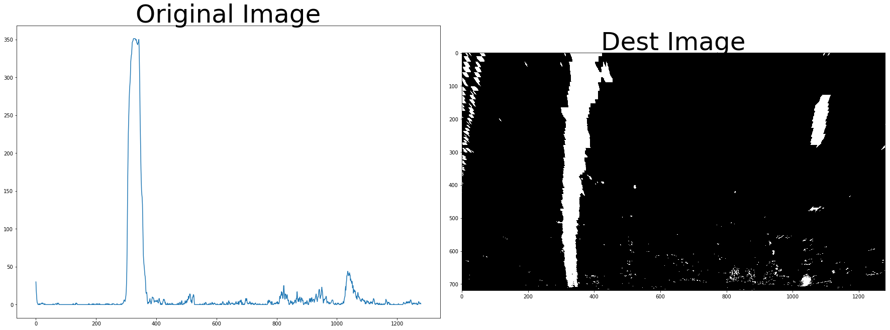
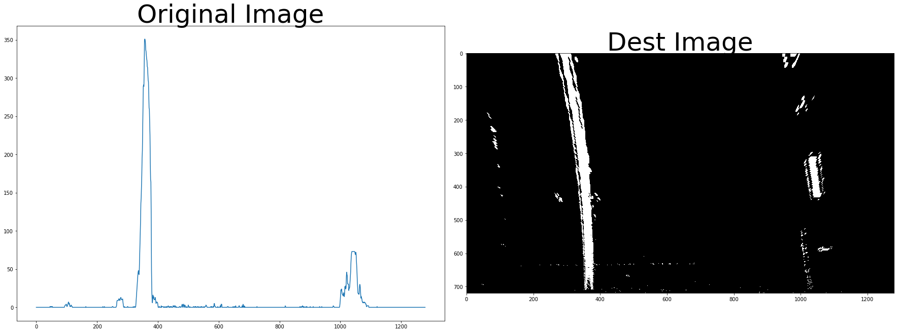
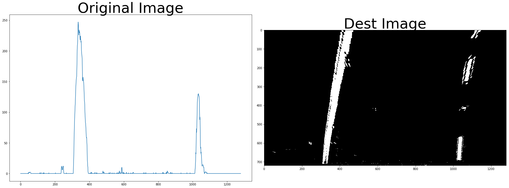
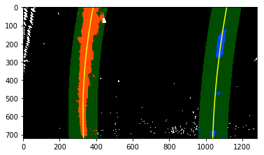
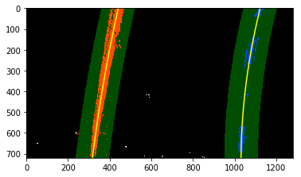
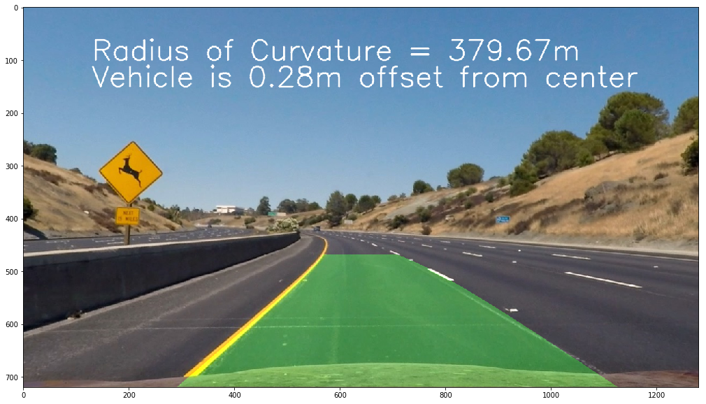

## Advanced Lane Finding

In this project, I will demonstrate from beginning what pipelines, processes or steps we need in order to achieve recognizing lane on the road.

The pipeline will start with a few images as a starting point and use it to demonstrate each step I take and lastly we can apply this pipeline to the video which is a series of images.

The steps are as follow,

1. Camera calibration
2. distortion correction
3. color/gradient threshold
4. Perspective transform
5. Detect lane lines
6. Calculate curvature

For the sake of shortness, there are 2 python classes I use in this project and will include in this notebook.

`advance_lane_finding.py` this is all the method containing all methods as part of pipeline I'll use throughout and `lane.py` which will use as utility class when I start applying pipeline to video.

I will start importing all necessary classes here.


```python
# import all needed lib here
import numpy as np
import cv2
import matplotlib.pyplot as plt
import matplotlib.image as mpimg
import glob
import random
from line import Line
from advance_lane_finding import *
%matplotlib inline
```

### 1. Camera calibration

I will do this step only one time to calibrate front camera with chessboard picture taken by the same camera. This process is to make sure we get `objpoints` and `imgpoints` to undistort all images from our front camera.

With the help of `cv2.findChessboardCorners` methods, we can detect corners in the calibrate chess board images.


```python
# Calibrate only one time and apply to all images
objpoints, imgpoints = generate_obj_image_points('./camera_cal')
```

### 2. distortion correction

Once we have Object Points `objpoints` and Image Points `imgpoints` calculate before we can apply this to `cv2.`

`ret, mtx, dist, rvecs, tvecs = cv2.calibrateCamera(objpoints, imgpoints, img.shape[1::-1], None, None)`

Now let visualize sample data before and after we undistort the images. The rest of pipeline we will start our pipeline with these steps before anything else.


```python
images = glob.glob('./camera_cal/calibration*.jpg')
for image in images[:3]:
    img_test = mpimg.imread(image)
    img_calibrate = cal_undistort(img_test, objpoints, imgpoints)
    display_2_images(img_test, img_calibrate)
```


### 3. color/gradient threshold

In this step first, we will look at Color and Gradient threshold to detect lane lines both yellow and white lines and at the same time filter out all unnecessary noises like shadow, darkness or road and etc.

#### Gradeint Threshold

We use Sobel operator or called Sobel-Feldman operator let say in short Sobel filter which is a technique I'm going to use to detect the edge. 

For more information please reference [Sobel operator](https://en.wikipedia.org/wiki/Sobel_operator)

The idea is we will detect the edge, gradient of magnitude and direction(we know lane line will be in a certain degree) of it. 

```
def abs_sobel_thresh(img, orient='x', sobel_kernel=3, thresh=(0, 255)):
    gray = cv2.cvtColor(img, cv2.COLOR_RGB2GRAY)
    sobel = None
    if orient == 'x':
        sobel = cv2.Sobel(gray, cv2.CV_64F, 1, 0, ksize=sobel_kernel)
    else:
        sobel = cv2.Sobel(gray, cv2.CV_64F, 0, 1, ksize=sobel_kernel)
    abs_sobel = np.absolute(sobel)
    scaled_sobel = np.uint8(255*abs_sobel/np.max(abs_sobel))
    return mask_with_threshold(scaled_sobel, thresh)
    
def mag_thresh(img, sobel_kernel=3, thresh=(0, 255)):    
    gray = cv2.cvtColor(img, cv2.COLOR_RGB2GRAY)
    # Take the gradient in x and y separately
    sobelx = cv2.Sobel(gray, cv2.CV_64F, 1, 0, ksize=sobel_kernel)
    sobely = cv2.Sobel(gray, cv2.CV_64F, 0, 1, ksize=sobel_kernel)
    # magnitude ==> sqrt(x^2 + y^2)
    mag = np.sqrt(sobelx**2 + sobely**2)
    # scale to 8 bit
    scaled_mag = np.uint8(255*mag/np.max(mag))
    return mask_with_threshold(scaled_mag, thresh)
    
def dir_threshold(img, sobel_kernel=3, thresh=(0, np.pi/2)): 
    gray = cv2.cvtColor(img, cv2.COLOR_RGB2GRAY)
    # Take the gradient in x and y separately
    sobelx = cv2.Sobel(gray, cv2.CV_64F, 1, 0, ksize=sobel_kernel)
    sobely = cv2.Sobel(gray, cv2.CV_64F, 0, 1, ksize=sobel_kernel)
    abs_sobelx = np.absolute(sobelx)
    abs_sobely = np.absolute(sobely)
    # np.arctan2(abs_sobely, abs_sobelx) to calculate the direction of the gradient
    arc_v = np.arctan2(abs_sobely, abs_sobelx)
    return mask_with_threshold(arc_v, thresh)
```

Then I have another method to combine them all, this way I can mix and match and find the best threshold. 

After trial and error for a while, I found a formula that works best to best to me.

* Apply SobelX in range 20 to 100 and SobelY in range 20 to 100
* Apply magnitude in range 30 to 100 and apply direction threshold in range of 40 to 75 degree
* Lastly, join above threshold together

```
def combine_gradient_threshold(img):
    # Apply each of the thresholding functions
    ksize = 3
    gradx = abs_sobel_thresh(img, orient='x', sobel_kernel=ksize, thresh=(20, 100))
    grady = abs_sobel_thresh(img, orient='y', sobel_kernel=ksize, thresh=(20, 100))
    mag_binary = mag_thresh(img, sobel_kernel=ksize, thresh=(30, 100))
    dir_binary = dir_threshold(img, sobel_kernel=ksize, thresh=(40*np.pi/180, 75*np.pi/180)) # 40 to 75 degree
    
    #combined all above threshold (gradx & grady) or (mag_binary and dir_binary)
    mask = np.zeros_like(dir_binary)
    mask[((gradx == 1) & (grady == 1)) | ((mag_binary == 1) & (dir_binary == 1))] = 1
    return mask
```
#### Combine Sobelx, Sobely, Magnitude and Direction of gradient

Let visualize the combination from sample images.


```python
images = glob.glob('./test_images/*.jpg')
for image in images[:3]: 
    #test sample imgage
    sample_image = mpimg.imread(image)
    binary = combine_gradient_threshold(sample_image)
    display_color_gray(sample_image, binary)

```


#### Color Threshold

Next, I look at images in RGB and HLS mode and look at each channel and again with trial and error to find the best detection.

Helper function to get the color channels I want, I use this function to help me mix and match color threshold and play around with all channels.
```
def color_threshold(img, channel, thresh=(0,255)):
    hls = cv2.cvtColor(img, cv2.COLOR_RGB2HLS)
    channel_v = None
    if channel == 'R':
        channel_v = img[:,:,0]
    elif channel == 'G':        
        channel_v = img[:,:,1]
    elif channel == 'B':        
        channel_v = img[:,:,2]
    elif channel == 'H':
        channel_v = hls[:,:,0]
    elif channel == 'L':        
        channel_v = hls[:,:,1]
    elif channel == 'S':        
        channel_v = hls[:,:,2]
        
    return mask_with_threshold(channel_v, thresh)
```

Then again, I have another method to combine them all like I did with gradient threshold. 

* Apply R and G color in range 200 to 255, I found this is the best to detect both yellow and white lane lines.
* Apply S in the range of 90 to 255 and L that I use to filter out the dark spots, shadows on the road out with 150 to 255 threshold.

```
def combine_color_threshold(img):
    r_channel = color_threshold(img, 'R', thresh=(200,255))
    g_channel = color_threshold(img, 'G', thresh=(200,255))
    
    s_channel = color_threshold(img, 'S', thresh=(90,255))
    l_channel = color_threshold(img, 'L', thresh=(150,255))
    
    #combined all above threshold (gradx & grady) or (mag_binary and dir_binary)
    mask = np.zeros_like(s_channel)
    mask[((r_channel == 1) & (g_channel == 1)) | ((s_channel == 1) & (l_channel == 1)) ] = 1
    return mask
```

#### Combine Color threshold 

Let visualize the combination of sample images.

I will show all channels in RGB and HLS however at the end I use just only R, G, S, and L as my last combination since it gave me the best result I want. Especially I pick the road with some noises of road darkness, dirt to show how it will look at each color channels


```python
images = glob.glob('./test_images/*.jpg')
for image in images[:4]:    
    sample_image = mpimg.imread(image)
    binary_R = color_threshold(sample_image, 'R', thresh=(200,255))
    binary_G = color_threshold(sample_image, 'G', thresh=(200,255))
    binary_B = color_threshold(sample_image, 'B', thresh=(200,255))
    f, (ax1, ax2, ax3) = plt.subplots(1, 3, figsize=(24, 9))
    f.tight_layout()
    ax1.imshow(binary_R, cmap='gray')
    ax1.set_title('R Image', fontsize=50)
    ax2.imshow(binary_G, cmap='gray')
    ax2.set_title('G Image', fontsize=50)
    ax3.imshow(binary_B, cmap='gray')
    ax3.set_title('B Image', fontsize=50)
    plt.subplots_adjust(left=0., right=1, top=0.9, bottom=0.)

    binary_H = color_threshold(sample_image, 'H', thresh=(90,255))
    binary_L = color_threshold(sample_image, 'L', thresh=(150,255))
    binary_S = color_threshold(sample_image, 'S', thresh=(90,255))
    f, (ax1, ax2, ax3) = plt.subplots(1, 3, figsize=(24, 9))
    f.tight_layout()
    ax1.imshow(binary_H, cmap='gray')
    ax1.set_title('H Image', fontsize=50)
    ax2.imshow(binary_L, cmap='gray')
    ax2.set_title('L Image', fontsize=50)
    ax3.imshow(binary_S, cmap='gray')
    ax3.set_title('S Image', fontsize=50)
    plt.subplots_adjust(left=0., right=1, top=0.9, bottom=0.)

    #The combination of Color threshold
    binary = combine_color_threshold(sample_image)
    display_color_gray(sample_image, binary)
```


#### Combine both Gradient and Color Threshold

At the end, I have my own color and gradient pipeline to use be noted with `visualize=True`, if specified, we can see the sample pictures. I found this very useful to debug pipeline along the way.

Green Color is a combined Color threshold and Blue color is the combined Sobel-x, Sobel-y, Magnitude and Direction of the gradient.


```python
images = glob.glob('./test_images/*.jpg')
for image in images[3:6]:    
    binary = pipeline_color_gradient(mpimg.imread(image), visualize=True)  

```


### 4. Perspective transform

This process is to convert a point from far away from the camera to become consistent with the closest lane or simple said we want to look at lane line in the bird eye view.

Basically I define the source coordinate and what destination coordinate I want to warp image similar to the undistort I do before.

Here is snippet of the code.

```
M = cv2.getPerspectiveTransform(src, dst)
M_inv = cv2.getPerspectiveTransform(dst, src)
warped = cv2.warpPerspective(img, M, img_size, flags = cv2.INTER_LINEAR)
```


```python
images = glob.glob('./test_images/*.jpg')
for image in images[3:6]:
    img = mpimg.imread(image)
    img_undistort = cal_undistort(img, objpoints, imgpoints)
    apply_treshhold = pipeline_color_gradient(img_undistort, visualize=False)
    warped, M, M_inv = warp(apply_treshhold)
    display_color_gray(img, warped)
```


### 5. Detect lane lines

At this stage, I got a warped images showing lane line of 2 lanes in parallel either straight or curve.

This is quite a complicated algorithms but not hard to understand. First I try a base of the left and right lane for start point to do the window slicing.

#### Finding the base of left and right lane

By counting a number of pixels in the x-axis, we can see that it's most likely the spikes of histogram must be the base of left and right lanes that we will use as information in sliding window to create a curve, straight polynomial line.


```python
images = glob.glob('./test_images/*.jpg')
for image in images[3:6]:
    img = mpimg.imread(image)
    img_undistort = cal_undistort(img, objpoints, imgpoints)
    apply_treshhold = pipeline_color_gradient(img_undistort, visualize=False)
    warped, M, M_inv = warp(apply_treshhold)
    
    # count number of 1 binary pixels
    histogram = np.sum(warped[warped.shape[0]//2:,:], axis=0)
    
    f, (ax1, ax2) = plt.subplots(1, 2, figsize=(24, 9))
    f.tight_layout()
    ax1.plot(histogram)
    ax1.set_title('Original Image', fontsize=50)
    ax2.imshow(warped, cmap='gray')
    ax2.set_title('Dest Image', fontsize=50)
    plt.subplots_adjust(left=0., right=1, top=0.9, bottom=0.)
    
```











#### Finding the lines through sliding window

This step we start from the bottom of the image (closest to the car) at the peak of the histogram image as the left and right lanes.  I will keep searching for 1 or the white pixel in my warped binary images. Defining window search area, I can ignore anything outside of the window and keep doing this until reaching the top of images.

At the end, I fit both left and right index of x, the y coordinate of white pixels to a polynomial line. So I will get both left and right line represented by this polynomial fit.

The implementation itself is in `advance_lane_finding.py` method `slicing_window` please reference for more details.

Now let visualize how it looks like!


```python
images = glob.glob('./test_images/*.jpg')
for image in images[3:6]:
    img = mpimg.imread(image)
    img_undistort = cal_undistort(img, objpoints, imgpoints)
    apply_treshhold = pipeline_color_gradient(img_undistort)
    warped, M, M_inv = warp(apply_treshhold)
    slicing_window(warped, visualize=True)
```








### 6. Calculate curvature

I've fit a polynomial to those pixel positions as shown earlier as red and blue line so I have put in the equation as mentioned  in this [reference](https://www.intmath.com/applications-differentiation/8-radius-curvature.php)

The last step is to warp it back to draw on original RGB images as we have `Inv_m` from step 4. The perspective transform then apply pixel/meters ratio.


```python
images = glob.glob('./test_images/*.jpg')
for image in images[3:6]:
    img = mpimg.imread(image)
    img_undistort = cal_undistort(img, objpoints, imgpoints)
    apply_treshhold = pipeline_color_gradient(img_undistort)
    warped, M, M_inv = warp(apply_treshhold)
    left_fit, right_fit, l_lane_inds, r_lane_inds = slicing_window(warped, visualize=False)

    aver_curverad, left_curverad, right_curverad, offset = cal_curve(warped.shape[0], warped.shape[1], left_fit, right_fit)
    # print(aver_curverad, left_curverad, right_curverad, offset)

    final_img = overlay_image(img_undistort, warped, M_inv, left_fit, right_fit, visualize=False)
    font = cv2.FONT_HERSHEY_SIMPLEX
    cv2.putText(final_img, "Radius of Curvature = {0:.2f}m".format(aver_curverad), (130, 100), font, 1.8, (255, 255, 255), 2, cv2.LINE_AA)
    cv2.putText(final_img, "Vehicle is {0:.2f}m offset from center".format(offset), (130, 150), font, 1.8, (255, 255, 255), 2, cv2.LINE_AA)
    
    plt.figure(figsize=(20,10))
    plt.imshow(final_img)    
    plt.show()
```





### Apply to video files

I have completed all the steps as mentioned 1 to 6, now it's time to apply to video file.

But before that, I introduced `line.py` as a class to hold a value of left_fix and right_fix so I can use the last 10 frames to smooth out the whole process.

I have implemented my pipeline in `process_video_images` method and this is the code

```
def process_video_images(img):
    img_undistort = cal_undistort(img, objpoints, imgpoints)
    apply_treshhold = pipeline_color_gradient(img_undistort, visualize=False)
    warped, M, M_inv = warp(apply_treshhold)

    if (not left_line.detected) and (not right_line.detected):
        left_fit, right_fit, l_lane_inds, r_lane_inds = slicing_window(warped,
        visualize=False)
    else:
        left_fit, right_fit, l_lane_inds, r_lane_inds = slicing_window(warped,
        left_fit = left_line.best_fit, right_fit = right_line.best_fit, visualize=False)

    left_line.update(left_fit)
    right_line.update(right_fit)

    aver_curverad, left_curverad, right_curverad, offset = cal_curve(warped.shape[0],
    warped.shape[1], left_fit, right_fit)

    final_img = overlay_image(img_undistort, warped, M_inv, left_fit, right_fit, visualize=False)
    font = cv2.FONT_HERSHEY_SIMPLEX
    cv2.putText(final_img, "Radius of Curvature = {0:.2f}m".format(aver_curverad), (130, 100), font, 1.8,
    (255, 255, 255), 2, cv2.LINE_AA)
    cv2.putText(final_img, "Vehicle is {0:.2f}m offset from center".format(offset), (130, 150), font, 1.8,
    (255, 255, 255), 2, cv2.LINE_AA)

    return final_img
```

And I can provide this method to video pipeline `generate_video` method in `advance_lane_finding.py` file.

There is an [advance_lane_finding.mp4](advance-lane-finding.mp4) video file showing continuous lane lines detection.

### Final thoughts

There are some issues along the way when working on this project, I have listed out for myself to make it even better.

1. The static threshold of color and gradient make it very difficult to apply the threshold to each image, I spent most of my time fine-tune this threshold. This could potentially be dynamic threshold depend on the road condition, light condition and etc.
2. Sliding window search, currently, it's left and right lane detection it could be improved to take these 2 lines and I know lane lines have to be parallel so in the future I can use this knowledge to make it even smoother.
